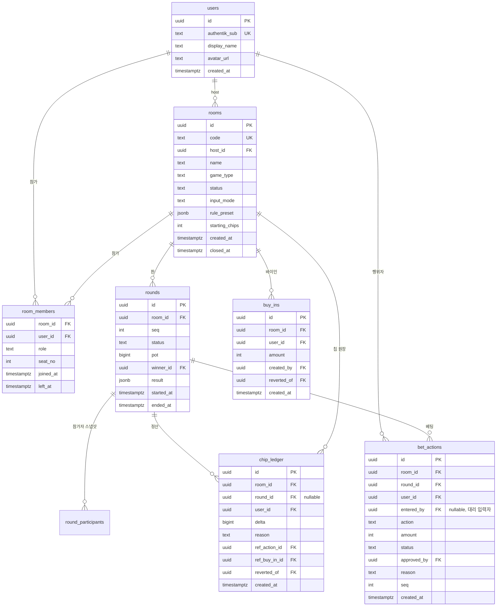

# 데이터 모델

| Field | Value |
|-------|-------|
| Type | technical-design |
| Audience | engineering / reviewers |
| Status | active |
| Source of truth | 구현 스키마는 `drizzle/schema.ts`, 이 문서는 관계·불변식·RLS 경계 |
| Last reviewed | 2026-07-24 |

구현 스키마는 `drizzle/schema.ts`가 소유한다. 현 스키마의 RLS·원장 트리거·권한 baseline은
`supabase/migrations/0007_database_hardening.sql`과 신규 테이블 보강용 `0008`이 소유한다.
적용 순서는 [`08-database-migrations.md`](08-database-migrations.md)가 소유한다. 실제 상태는
`pg_policies`, `information_schema.role_table_grants`, `pg_class.relrowsecurity`로 확인한다.

## Context

방 단위로 격리된 실시간 게임 기록. 핵심 요구는 두 가지다.

1. **칩 잔액을 신뢰할 수 있어야 한다** — 분쟁이 나면 근거를 제시할 수 있어야 하고, 정정해도
   원래 기록이 남아야 한다.
2. **다른 방/다른 그룹 데이터가 절대 새면 안 된다** — 클라이언트가 DB를 직접 건드릴 경로 자체를
   없애서 막는다.

## DB 접근 경로

이 프로젝트는 Supabase의 service role key도, Auth.js 세션을 Supabase JWT로 바꾸는 브리지도
쓰지 않는다. 두 개의 분리된 경로만 있다.

1. **Server Action → `kkeutbal_app` 롤(`BYPASSRLS`)**. `src/lib/db.ts`가 drizzle +
   postgres-js로 Supabase pooler에 붙는다. 포트 5432(session)는 `max: 5`와 prepared statement를,
   포트 6543(transaction)는 `max: 1`과 `prepare: false`를 자동 적용하며 Supabase CA를 검증한다.
   모든 읽기·쓰기가 이 경로를 지난다. 단, 전역 credit 테이블은 이 롤의 직접 DML을 막고 전용
   RPC(`ensure_credit_account`, `admin_adjust_credit`, `lock_room_credit_buy_in`,
   `release_room_credit_buy_in`, `settle_room_credits`)로만 변경한다. 권한 검사(방 참가 여부, host/dealer 역할 등)는
   RLS가 아니라 각 Server Action이 쿼리로 직접 한다 (`src/features/betting/actions.ts`,
   `src/features/budget/actions.ts` 등).
2. **브라우저 → Supabase publishable key**. `src/lib/supabase/client.ts`가 명시하듯 이 클라이언트는
   **테이블 조회에 쓰지 않는다.** 용도는 Realtime Broadcast/Presence 구독
   (`room:{room_id}` 공개 채널, `03-realtime-protocol.md`)뿐이다.

브라우저는 Supabase Auth 세션을 갖지 않으며, `anon`·`authenticated`에는 테이블·시퀀스·함수
권한을 주지 않는다. 브라우저가 PostgREST를 직접 호출해도 RLS와 권한에서 거부된다.

## 핵심 설계: 칩은 원장(ledger)이다

`room_members`에 가변 잔액 컬럼을 두지 않는다. 칩 이동은 `chip_ledger`에 append-only로 쌓고,
잔액은 합계로 도출한다.

```
잔액(user, room) = SUM(chip_ledger.delta) WHERE room_id, user_id
```

이유:

- 정정은 행 수정이 아니라 **반대 부호 행 추가**(`reverted_of`로 원본 참조)로 처리한다.
  원래 입력이 그대로 남아 누가 언제 뭘 잘못 넣었고 누가 고쳤는지가 보존된다.
  `src/features/betting/actions.ts`의 `revertBet`이 이 패턴대로 구현돼 있다.
- 동시 입력에서 UPDATE 경합이 사라진다. INSERT만 하므로 lost update가 구조적으로 불가능하다.
- 세션 정산 검증이 단순해진다: 방 전체 `SUM(delta) === 0`이면 칩이 보존됐다는 뜻이다.

동시성은 원장 자체가 아니라 **방 단위 `pg_advisory_xact_lock`**으로 막는다. `placeBet`,
`approveBet`, `revertBet`, `addBuyIn` 모두 트랜잭션 시작 직후
`pg_advisory_xact_lock(hashtextextended(room_id, 42))`를 잡고 잔액·상태를 재조회한다 —
락 이전에 읽은 값을 락 이후에 그대로 쓰지 않는다.

비용: 잔액 조회가 집계가 된다. 방당 행 수가 수천 단위라 실사용 규모에서 문제되지 않으며,
`(room_id, user_id)` 인덱스로 충분하다.

## ERD



## 테이블 상세

### `users`

내부 계정·Authentik·게스트 신원을 하나의 사용자로 해석한다. 이메일은 보관하지 않으며 내부
계정만 bcrypt `password_hash`와 숫자 정규화한 전화번호를 가진다.

- `authentik_sub` — 유일 키. OIDC `sub` 클레임 또는 내부 계정의 `local:{username}` 형태.
  같은 sub → 같은 계정. 로그인 시 upsert.
- 표시 이름·아바타는 로컬 편집 가능(방에서 부르는 별명).

### `guest_tokens`

- 신규 발급은 `code_hash`에 `AUTH_SECRET` HMAC만 저장하고 원문은 발급 응답에서 한 번만 보여준다.
- 구버전 `code` 원문 행은 로그인 또는 이름 조회 성공 시 해시로 전환하고 원문을 지운다.
- `expires_at`·`revoked_at`으로 새 로그인을 차단한다.

### `auth_settings`

인스턴스 단위 인증 설정의 단일 행(`id = 'default'`)이다. SSO 활성 여부·Issuer·Client ID를 두고,
Client secret은 `AUTH_SECRET` 기반 AES-GCM 암호문만 저장한다. 읽기·변경은 관리자 Server Action만 한다.

### `registration_codes`

- `code_hash` — `AUTH_SECRET` 기반 HMAC. 원문 가입코드는 DB에 저장하지 않는다.
- `label` — 발급 목적을 식별하는 운영 메모.
- `expires_at` / `revoked_at` — 만료 또는 회수된 코드는 회원가입에 사용할 수 없다.
- `/admin`의 관리자 액션만 생성·회수하며, 원문은 발급 응답에서만 한 번 반환된다.

### `rate_limit_buckets`

로그인·가입·가입코드·게스트·Vision 남용 방지용 고정 창 카운터다. IP·아이디·토큰 원문 대신
scope와 식별자를 `AUTH_SECRET`으로 HMAC한 `key_hash`만 저장하고 만료 인덱스로 정리한다.

### `promotions`

관리자 운영 공지다. `banner`는 활성 시간창 안의 항목을 우선순위순으로 모두, `popup`은 가장 높은
우선순위 한 개만 노출한다. “N시간 동안 보지 않기” 상태는 사용자 계정이 아니라 브라우저 localStorage에
저장해 게스트도 같은 동작을 한다.

### `rooms`

- `code` — 6자 대문자+숫자 입장 코드.
- `name` — 방 표시 이름.
- `game_type` — `seotda` | `gostop` | `poker`.
- `status` — `waiting` | `playing` | `settled` | `closed`.
- `input_mode` — `trust`(즉시 반영) | `approval`(딜러 승인 필요). `host`/대리 입력하는
  `dealer`는 `approval` 모드에서도 자기 자신의 액션은 즉시 확정된다(`placeBet`의
  `autoAccept` 로직).
- `rule_preset` — 지역 룰 편차를 담는 jsonb. 스키마는 `04-game-engines.md`가 소유.

### `room_members`

- `role` — `host` | `dealer` | `player` | `observer`. `observer`는 베팅 불가
  (`placeBet`에서 명시적으로 거부).
- `left_at` — 나가도 행을 지우지 않는다(soft leave). `game/queries.ts`의 활성 목록 조회는
  `isNull(leftAt)`로 필터한다.

### `rounds`

- `seq` — 방 내 판 번호. `(room_id, seq)` 유니크.
- `status` — `playing` | `ended` | `voided`.
- `result` — 게임별 결과 상세 jsonb. `note` 필드를 `readResultNote`가 읽어 마지막 결과 요약에
  쓴다.

### `round_participants`

판 시작 시점의 활성 비관전자 목록을 `(round_id, user_id)`로 저장한다. 재입장으로
`room_members.joined_at`이 바뀌거나 현재 역할이 달라져도 실제 판 참가·베팅 자격·전적 집계는
이 스냅샷을 기준으로 유지한다.

### `bet_actions`

- `id` — **클라이언트가 생성한 UUID**. 멱등키. `placeBet`은 같은 `id`가 이미 있으면 재삽입하지
  않고 기존 행을 그대로 반환한다.
- `entered_by` — 대리 입력 시 실제 입력자(딜러). 본인 입력이면 null.
- `status` — `pending` | `accepted` | `rejected` | `reverted`.
- `approved_by` — 승인/거절/자동거절 처리자.
- `reason` — 거절·정정 사유. `rejectBet`/`revertBet`은 사유 없이는 호출 자체가 막힌다
  (zod `min(1)`).
- `amount` — **이번 액션에서 실제로 이동한 칩** 단위 정수. 콜·레이즈 기준은 accepted 액션을
  사용자별로 합산한 누적 납입액이다. 따라서 재레이즈 뒤에도 기존 납입분을 다시 차감하지 않는다.
- `seq` — 판 내 순번. 서버가 커밋 시 `max(seq)+1`로 확정한다.

### `chip_ledger`

append-only. UPDATE·DELETE는 트리거로 원천 차단한다(아래 "원장 불변성").

- `delta` — 부호 있는 정수. 지출 음수, 획득 양수.
- `reason` — `buy_in` | `bet` | `pot_win` | `correction` | `settlement`.
- `ref_action_id` — 이 원장 행을 만든 `bet_actions.id`(있는 경우).
- `ref_buy_in_id` — 바이인 또는 바이인 취소가 만든 원장 행의 정확한 `buy_ins.id`.
- `reverted_of` — 정정 행이 원본 원장 행을 가리킨다. 원본은 그대로 둔다.
- 쓰기 경로는 오직 Server Action(`kkeutbal_app`, bypassrls)이다. `authenticated`용
  INSERT/UPDATE/DELETE RLS 정책이 없어 브라우저가 Supabase REST/클라이언트로 직접 쓰는 것은
  이중으로 막혀 있다(정책 부재 + 애초에 그 경로로 접속하지 않음).

### `buy_ins`

- `created_by` — 실제 입력자. 본인 또는 host/dealer.
- `reverted_of` — 바이인 취소 행이 원본 바이인을 가리킨다. 한 원본은 한 번만 취소할 수 있다.
- `chip_ledger`에 `reason='buy_in'` 행을 함께 남긴다(`addBuyIn`이 같은 트랜잭션에서 두 INSERT를
  수행).

### 제거된 테이블 — `groups` / `group_members` / `hand_records` (2026-07-23)

세 테이블 모두 스키마에만 존재하고 어떤 코드도 읽거나 쓰지 않아 제거했다
(`drizzle/migrations/0001_silent_moondragon.sql` — `rooms.group_id` 컬럼과 `hand_source`
enum 포함). 이 결정으로 누적 랭킹은 **전역 사용자 단위로 확정**됐고, Advisor 판독 결과는
**저장하지 않는 것이 확정 동작**이다. 분기 근거·재검토 트리거는 `docs/design-decisions/`
001이 소유한다.

## 인덱스

| 인덱스 | 목적 |
|--------|------|
| `rooms(code)` unique | 입장 조회 |
| `room_members(room_id, user_id)` PK | 참가 판정 · RLS 헬퍼 |
| `room_members(room_id, seat_no)` unique | 좌석 중복 방지 |
| `chip_ledger(room_id, user_id)` | 잔액 집계 |
| `chip_ledger(room_id, created_at)` | 원장 타임라인 |
| `chip_ledger(ref_buy_in_id)` | 바이인과 원장 직접 연결 |
| `rounds(room_id, seq)` unique | 판 순서 · 충돌 판정 |
| `rounds(room_id) where status='playing'` unique | 방마다 진행 중 판 하나 |
| `bet_actions(round_id, seq)` unique | 판 내 액션 순서 |
| `round_participants(round_id, user_id)` PK | 판 참가자 정본 |
| `buy_ins(room_id, user_id)` | 방·사용자별 바이인 합계 |
| `*_user_id` / `*_created_by` / `*_host_id` FK 인덱스 | 사용자 삭제·관리자 감사·방장 조회의 역방향 FK 탐색 |
| `bet_actions(room_id/user_id/entered_by/approved_by)` | 방별 액션·입력자·승인자 조회와 FK 검증 |
| `chip_ledger(user_id/ref_action_id)` | 사용자 이력·액션 정정 근거 조회 |
| `credit_transactions(round_id, created_at)` / `room_credit_locks(user_id/lock_transaction_id)` | credit 정산 감사와 FK 역방향 조회 |

## RLS 원칙

전 테이블 `ENABLE ROW LEVEL SECURITY`. 목적은 애플리케이션 버그가 있어도 데이터가 새지
않는 것이지만, 위 "DB 접근 경로"에서 서술한 대로 **오늘 이 정책들이 막는 대상은 브라우저가
Supabase 테이블 API를 직접 호출하는 가상의 경로다.** 실제 앱 트래픽(Server Action)은
`kkeutbal_app`으로 RLS를 우회하고, 권한 검사는 Server Action 코드 안에서 한다.
`0007_database_hardening.sql`은 `anon`·`authenticated`의 테이블·시퀀스·함수 권한을 회수한다.
따라서 Auth.js 사용자라도 Supabase Data API로는 어떤 앱 테이블도 읽거나 쓸 수 없다.

`kkeutbal_app`은 `bypassrls`이지만 일반 게임 테이블에는 SELECT/INSERT/UPDATE/DELETE만,
시퀀스에는 USAGE/SELECT만 가진다. credit 4개 테이블에는 SELECT만 주고 write는 관리자 조정
`admin_adjust_credit`과 방 재원 수명주기 `lock_room_credit_buy_in`·`release_room_credit_buy_in`·
`settle_room_credits` RPC가 내부 primitive로 처리한다. `post_credit_transaction`은 앱 롤이 직접
실행할 수 없다. TRUNCATE·TRIGGER·REFERENCES 권한은 주지 않는다. `session_standings` 뷰도
브라우저에는 열지 않으며, 현재 앱 기능은 이 뷰를 읽지 않는다.

`chip_ledger` INSERT를 `authenticated`에 열지 않은 이유: 칩 생성은 게임 규칙 판정 결과여야
한다. 정책이 없다는 것 자체가 방어층이고, 실제 쓰기는 Server Action이 엔진 검증 후
`kkeutbal_app`으로 수행한다(과거 이 문서가 "service role"이라 서술한 것은 오기 — service role
key는 이 프로젝트에서 쓰지 않는다).

### 원장 불변성

`chip_ledger`에 `BEFORE UPDATE OR DELETE` 트리거
(`chip_ledger_is_append_only`)가 걸려 있어 `kkeutbal_app`(bypassrls)의 실수도 막는다.
UPDATE/DELETE 시도는 예외를 던진다. 정정은 `reverted_of`로 원본을 가리키는 새 행 INSERT로만
한다.

### Realtime 채널 권한

공개 Realtime 채널은 RLS로 보호되지 않는다. `src/lib/realtime/client.ts`는 `room:{room_id}`
채널을 publishable key로 구독한다. payload는 힌트일 뿐이며 수신자는 항상 Server Action
스냅샷을 다시 읽는다. private 채널로 전환하려면 Supabase JWT 브리지와 별도
`realtime.messages` 정책이 필요하다. 상세 프로토콜은 `03-realtime-protocol.md`가 소유한다.

## 파생 조회

랭킹은 테이블로 저장하지 않고 뷰로 도출한다. 저장하면 원장과 이중 진실이 되고 갱신 누락이
생긴다.

- `session_standings(room_id)` — `chip_ledger` 합계 대비 `buy_ins` 합계로 방 참가자별
  `balance`/`buy_in_total`/`net`을 낸다. `security_invoker=true`. **현재 어떤 기능도 조회하지
  않는다** — `game/queries.ts`는 잔액을 이 뷰가 아니라 `chip_ledger`를 직접 집계해서 얻는다.
- `cumulative_standings(group_id)` — 폐기. `groups` 제거(2026-07-23)로 그룹 스코프 자체가
  없어졌다. 누적 랭킹은 `getCumulativeRanking()`이 전역 사용자 단위로 집계한다.

지표 정의는 구현(`src/features/ranking/queries.ts`)이 소유한다.

## 불변식

구현·테스트가 지켜야 할 조건.

1. `SUM(chip_ledger.delta) - SUM(buy_ins.amount) = 0` (정산 완료 시점).
2. 어떤 사용자의 방 내 잔액도 음수가 될 수 없다 — `placeBet`/`approveBet`은 쓰기 전에
   `balanceOf`로 확인한다.
3. `bet_actions.id`는 클라이언트 생성 UUID이며 재삽입은 무시된다(기존 행 반환, 멱등).
4. `chip_ledger`는 INSERT 외 어떤 변경도 발생하지 않는다 — 트리거로 강제.
5. `rounds(room_id, seq)`는 빈 번호 없이 1부터 증가한다.
6. 동시 쓰기는 방 단위 `pg_advisory_xact_lock`으로 직렬화된다 — 락 밖에서 읽은 잔액/상태로
   커밋하지 않는다.
7. 방마다 `playing` 판은 최대 하나이며, 판 참가자는 `round_participants`로 고정한다.

## Open Questions

- [ ] 공개 Realtime 채널을 private 채널로 전환할지 결정. 전환하려면 Auth.js↔Supabase JWT
      브리지와 별도 RLS 정책이 필요하다.
- [ ] 그룹 미지정 단발성 방(즉석 판)의 누적 랭킹 귀속 처리 — 개인 기록으로만 남길지 결정 필요.
- [ ] 방 보존 기간·아카이빙 정책. 무기한 보관 시 무료 티어 용량 검토 필요.
