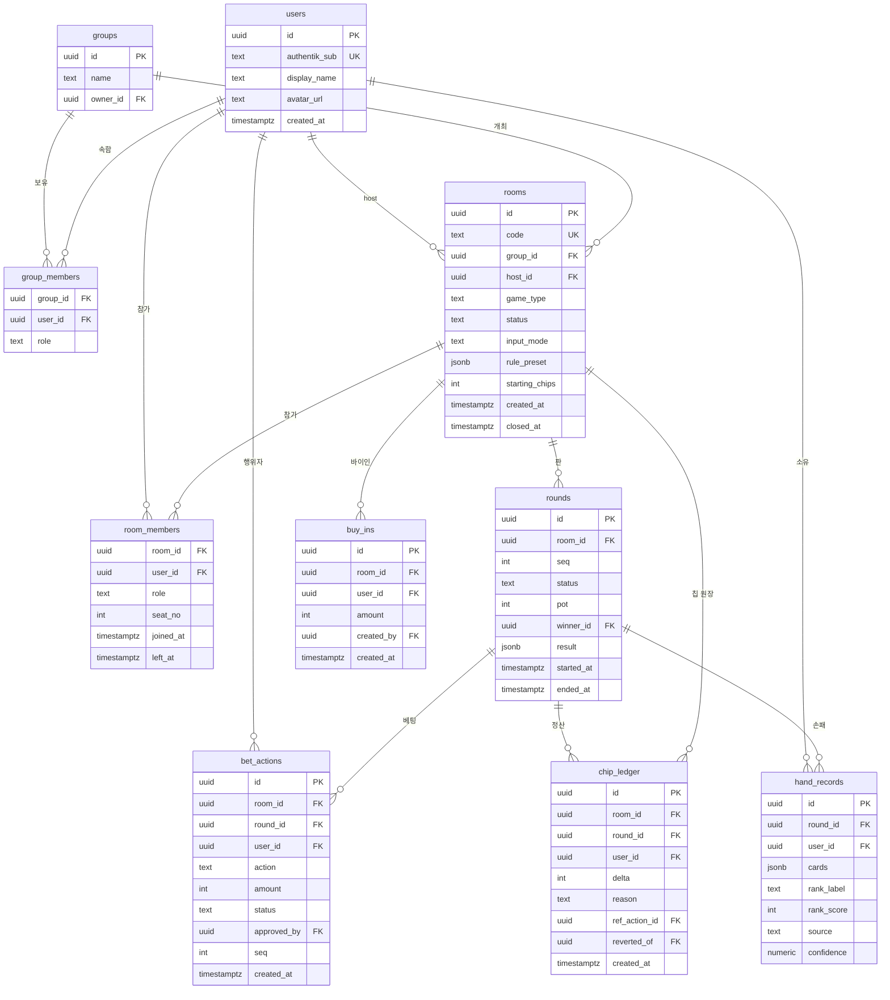

# 데이터 모델

| Field | Value |
|-------|-------|
| Type | technical-design |
| Audience | engineering / reviewers |
| Status | draft |
| Source of truth | this document (테이블·관계·RLS 원칙) |
| Last reviewed | 2026-07-22 |

구현 스키마는 `drizzle/schema.ts`, RLS·realtime SQL은 `supabase/migrations/0001_init.sql`이
반영한다. 두 파일과 이 문서가 어긋나면 **이 문서를 먼저 고치고** 코드를 맞춘다.

## Context

방 단위로 격리된 실시간 게임 기록. 핵심 요구는 두 가지다.

1. **칩 잔액을 신뢰할 수 있어야 한다** — 분쟁이 나면 근거를 제시할 수 있어야 하고, 정정해도
   원래 기록이 남아야 한다.
2. **다른 방/다른 그룹 데이터가 절대 새면 안 된다** — 애플리케이션 코드가 아니라 DB에서 막는다.

## 핵심 설계: 칩은 원장(ledger)이다

`room_members.chips` 같은 **가변 잔액 컬럼을 두지 않는다.** 칩 이동은 `chip_ledger`에
append-only로 쌓고, 잔액은 합계로 도출한다.

```
잔액(user, room) = SUM(chip_ledger.delta) WHERE room_id, user_id
```

이유:

- 정정은 행 수정이 아니라 **반대 부호 행 추가**(`reverted_of`로 원본 참조)로 처리한다.
  원래 입력이 그대로 남아 "누가 언제 뭘 잘못 넣었고 누가 고쳤는지"가 보존된다 (요구 R3.5).
- 동시 입력에서 UPDATE 경합이 사라진다. INSERT만 하므로 lost update가 구조적으로 불가능하다.
- 세션 정산 검증이 단순해진다: 방 전체 `SUM(delta) === 0` 이면 칩이 보존됐다는 뜻이다.

비용: 잔액 조회가 집계가 된다. 방당 행 수가 수천 단위라 실사용 규모에서 문제되지 않으며,
`(room_id, user_id)` 인덱스와 세션 종료 시 스냅샷으로 충분하다.

## ERD



## 테이블 상세

### `users`

Authentik이 신원의 소유자다. 이 테이블은 **미러**이며 비밀번호·이메일 인증 상태를 보관하지 않는다.

- `authentik_sub` — OIDC `sub` 클레임. 유일 키. 로그인 시 upsert.
- 표시 이름·아바타는 로컬 편집 가능(방에서 부르는 별명).

### `groups` / `group_members`

누적 랭킹의 범위 단위. "우리 과 MT 모임" 같은 친구 그룹.
전역 랭킹을 만들지 않는 이유는 지인 집단 밖 비교가 의미 없고, 데이터 노출 범위를 좁히기 위해서다.

### `rooms`

- `code` — 6자 대문자+숫자. 입장 키. 혼동 문자(`0/O`, `1/I`) 제외.
- `game_type` — `seotda` | `gostop`. 엔진 선택에 사용.
- `status` — `waiting` | `playing` | `settled` | `closed`.
- `input_mode` — `trust`(즉시 반영) | `approval`(딜러 승인 필요). 요구 R3.4.
- `rule_preset` — 지역 룰 편차를 담는 jsonb. 스키마는 `04-game-engines.md`가 소유.
  **컬럼으로 쪼개지 않는 이유**: 룰 항목이 게임마다 다르고 자주 늘어난다. 질의 대상이 아니라
  엔진 입력값일 뿐이므로 jsonb가 맞다.

### `room_members`

- `role` — `host` | `dealer` | `player` | `observer`. 권한 매핑은 `07-auth-and-security.md`.
- `left_at` — 나가도 행을 지우지 않는다. 과거 판의 참가 기록이 필요하다 (soft leave).

### `rounds`

- `seq` — 방 내 판 번호. `(room_id, seq)` 유니크. 동시 입력 충돌 판정 기준(요구 R2.3, Edge Case).
- `result` — 게임별 결과 상세 jsonb (섯다: 승자 족보 / 고스톱: 점수 내역).

### `bet_actions`

- `id` — **클라이언트가 생성한 UUID**. 멱등키. 재전송해도 PK 충돌로 흡수된다.
- `status` — `pending` | `accepted` | `rejected` | `reverted`.
- `amount` — 칩 단위 정수. **금액은 정수만 쓴다** (부동소수 반올림 오차 차단).

### `chip_ledger`

append-only. UPDATE·DELETE를 RLS와 트리거로 금지한다.

- `delta` — 부호 있는 정수. 지출 음수, 획득 양수.
- `reason` — `buy_in` | `bet` | `pot_win` | `correction` | `settlement`.
- `reverted_of` — 정정 행이 원본을 가리킨다. 원본은 그대로 둔다.

### `hand_records`

족보 판독 기록. `source`가 `vision`이면 `confidence`를 함께 남겨 오인식 추적이 가능하다.
**기본 가시성은 본인**이며, 판이 끝난 뒤에만 방에 공개된다 (요구 R5.4).

## 인덱스

| 인덱스 | 목적 |
|--------|------|
| `rooms(code)` unique | 입장 조회 |
| `room_members(room_id, user_id)` unique | 참가 판정 · RLS 헬퍼 |
| `chip_ledger(room_id, user_id)` | 잔액 집계 |
| `chip_ledger(room_id, created_at)` | 원장 타임라인 |
| `rounds(room_id, seq)` unique | 판 순서 · 충돌 판정 |
| `bet_actions(round_id, seq)` | 판 내 액션 순서 |
| `hand_records(round_id, user_id)` unique | 판당 1인 1손패 |

## RLS 원칙

전 테이블 `ENABLE ROW LEVEL SECURITY`. 애플리케이션 버그가 있어도 데이터가 새지 않는 것이 목표다.

핵심 헬퍼:

```sql
create or replace function public.is_room_member(p_room_id uuid)
returns boolean
language sql stable security definer set search_path = public
as $$
  select exists (
    select 1 from room_members
    where room_id = p_room_id and user_id = auth.uid()
  );
$$;
```

정책 요약:

| 테이블 | SELECT | INSERT | UPDATE/DELETE |
|--------|--------|--------|----------------|
| `rooms` | 참가자 또는 코드로 조회 중인 인증 사용자 | 인증 사용자 | host만 |
| `room_members` | 같은 방 참가자 | 본인 입장 또는 host | host만 |
| `rounds` | 방 참가자 | dealer/host | dealer/host |
| `bet_actions` | 방 참가자 | 본인 행위자 | 승인/거절은 dealer/host |
| `chip_ledger` | 방 참가자 | 서버(service role) 전용 | **전면 금지** |
| `hand_records` | 본인, 판 종료 후 방 참가자 | 본인 | 본인, 판 종료 전까지 |

`chip_ledger` INSERT를 클라이언트에 열지 않는 이유: 칩 생성은 게임 규칙 판정 결과여야 한다.
Server Action이 엔진으로 검증한 뒤 service role로 기록한다.

### Realtime 채널 권한

Broadcast/Presence 권한은 `realtime.messages` 테이블 RLS로 강제하고, 클라이언트는
`private: true`로 구독한다. 토픽 규칙은 `room:{room_id}`이며 정책은 "그 방 참가자만"이다.
정책은 **구독 시 1회 평가 후 커넥션 동안 캐시**되므로 메시지마다 DB를 조회하지 않는다.
상세는 `03-realtime-protocol.md`.

## 파생 조회

랭킹은 테이블로 저장하지 않고 뷰로 도출한다. 저장하면 원장과 이중 진실이 되고 갱신 누락이 생긴다.

- `session_standings(room_id)` — 방 참가자별 순손익·승수·참여 판수.
- `cumulative_standings(group_id)` — 그룹 기준 누적 집계. 느려지면 그때 materialized view로 승격.

지표 정의는 `06-features-ranking-budget-betting.md`가 소유한다.

## 불변식

구현·테스트가 지켜야 할 조건.

1. `SUM(chip_ledger.delta)` per room = 0 (정산 완료 시점).
2. 어떤 사용자의 방 내 잔액도 음수가 될 수 없다.
3. `bet_actions.id`는 클라이언트 생성 UUID이며 재삽입은 무시된다(멱등).
4. `chip_ledger`는 INSERT 외 어떤 변경도 발생하지 않는다.
5. `rounds(room_id, seq)`는 빈 번호 없이 1부터 증가한다.

## Open Questions

- [ ] 그룹 미지정 단발성 방(즉석 판)의 누적 랭킹 귀속 처리 — 개인 기록으로만 남길지 결정 필요.
- [ ] 방 보존 기간·아카이빙 정책. 무기한 보관 시 무료 티어 용량 검토 필요.
