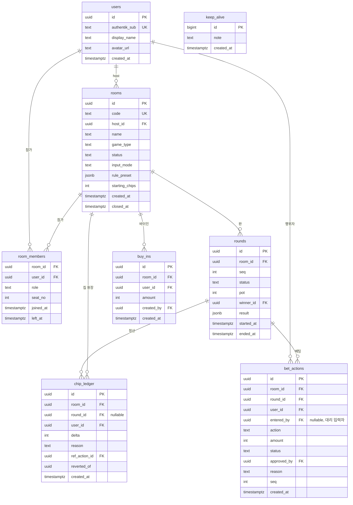

# 데이터 모델

| Field | Value |
|-------|-------|
| Type | technical-design |
| Audience | engineering / reviewers |
| Status | draft |
| Source of truth | this document (테이블·관계·RLS 원칙) |
| Last reviewed | 2026-07-23 |

구현 스키마는 `drizzle/schema.ts`가 소유한다. RLS·트리거·`keep_alive`·`kkeutbal_app` 권한은
Supabase 프로젝트에 3개 마이그레이션으로 적용돼 있다: `init_schema`(drizzle 생성 DDL),
`init_rls`(`supabase/migrations/0001_init_rls.sql`), `keep_alive_and_app_grants`.
**`keep_alive_and_app_grants`는 supabase MCP로 직접 적용했고 로컬 SQL 파일로 미러링돼 있지
않다** — 이 문서가 그 내용의 유일한 서술이다. 실제 적용 상태 확인은 `list_migrations` /
`list_tables` / `pg_policies` 조회로 한다. 코드·DB 실제 상태와 이 문서가 어긋나면 **DB를
조회해 이 문서를 고치고** 코드를 맞춘다.

## Context

방 단위로 격리된 실시간 게임 기록. 핵심 요구는 두 가지다.

1. **칩 잔액을 신뢰할 수 있어야 한다** — 분쟁이 나면 근거를 제시할 수 있어야 하고, 정정해도
   원래 기록이 남아야 한다.
2. **다른 방/다른 그룹 데이터가 절대 새면 안 된다** — 클라이언트가 DB를 직접 건드릴 경로 자체를
   없애서 막는다.

## DB 접근 경로

이 프로젝트는 Supabase의 service role key도, Auth.js 세션을 Supabase JWT로 바꾸는 브리지도
쓰지 않는다. 두 개의 분리된 경로만 있다.

1. **Server Action → `kkeutbal_app` 롤(`BYPASSRLS`)**. `src/lib/db.ts`가 drizzle +
   postgres-js로 Supabase pooler(`aws-1-ap-northeast-2`, session mode, 포트 5432)에
   붙는다. 모든 읽기·쓰기가 이 경로를 지난다. 권한 검사(방 참가 여부, host/dealer 역할 등)는
   RLS가 아니라 각 Server Action이 쿼리로 직접 한다 (`src/features/betting/actions.ts`,
   `src/features/budget/actions.ts` 등).
2. **브라우저 → Supabase publishable key**. `src/lib/supabase/client.ts`가 명시하듯 이 클라이언트는
   **테이블 조회에 쓰지 않는다.** 용도는 두 가지뿐이다: Realtime Broadcast/Presence 구독
   (`room:{room_id}` 공개 채널, `03-realtime-protocol.md`), 그리고 `keep-alive.yml`
   워크플로가 REST로 `keep_alive` 테이블에 넣고 지우는 것.

이 구조에서 `authenticated` 롤을 대상으로 한 RLS 정책(아래 표)은 **현재 어떤 클라이언트도
그 롤로 접속하지 않으므로 살아있는 트래픽에는 적용되지 않는다.** 브라우저는 항상 `anon`이고,
`anon`에 정책이 열린 테이블은 `keep_alive`뿐이다. `authenticated` 정책은 방어층으로 남겨둔
것이며, Auth.js↔Supabase JWT 브리지를 실제로 붙이기 전까지는 문서상 의도 그 이상이 아니다.

## 핵심 설계: 칩은 원장(ledger)이다

`room_members`에 가변 잔액 컬럼을 두지 않는다. 칩 이동은 `chip_ledger`에 append-only로 쌓고,
잔액은 합계로 도출한다.

```
잔액(user, room) = SUM(chip_ledger.delta) WHERE room_id, user_id
```

이유:

- 정정은 행 수정이 아니라 **반대 부호 행 추가**(`reverted_of`로 원본 참조)로 처리한다.
  원래 입력이 그대로 남아 누가 언제 뭘 잘못 넣었고 누가 고쳤는지가 보존된다.
  `src/features/betting/actions.ts`의 `revertBet`이 이 패턴대로 구현돼 있다.
- 동시 입력에서 UPDATE 경합이 사라진다. INSERT만 하므로 lost update가 구조적으로 불가능하다.
- 세션 정산 검증이 단순해진다: 방 전체 `SUM(delta) === 0`이면 칩이 보존됐다는 뜻이다.

동시성은 원장 자체가 아니라 **방 단위 `pg_advisory_xact_lock`**으로 막는다. `placeBet`,
`approveBet`, `revertBet`, `addBuyIn` 모두 트랜잭션 시작 직후
`pg_advisory_xact_lock(hashtextextended(room_id, 42))`를 잡고 잔액·상태를 재조회한다 —
락 이전에 읽은 값을 락 이후에 그대로 쓰지 않는다.

비용: 잔액 조회가 집계가 된다. 방당 행 수가 수천 단위라 실사용 규모에서 문제되지 않으며,
`(room_id, user_id)` 인덱스로 충분하다.

## ERD



`keep_alive`는 다른 테이블과 관계가 없다 — Supabase 무료 티어 자동 일시정지를 막는 REST
핑 대상일 뿐이다.

## 테이블 상세

### `users`

Authentik이 신원의 소유자다. 이 테이블은 미러이며 비밀번호·이메일을 보관하지 않는다.

- `authentik_sub` — 유일 키. OIDC `sub` 클레임 또는 내부 계정의 `local:{username}` 형태.
  같은 sub → 같은 계정. 로그인 시 upsert.
- 표시 이름·아바타는 로컬 편집 가능(방에서 부르는 별명).

### `registration_codes`

- `code_hash` — `AUTH_SECRET` 기반 HMAC. 원문 가입코드는 DB에 저장하지 않는다.
- `label` — 발급 목적을 식별하는 운영 메모.
- `expires_at` / `revoked_at` — 만료 또는 회수된 코드는 회원가입에 사용할 수 없다.
- `/admin`의 관리자 액션만 생성·회수하며, 원문은 발급 응답에서만 한 번 반환된다.

### `rooms`

- `code` — 6자 대문자+숫자 입장 코드.
- `name` — 방 표시 이름.
- `game_type` — `seotda` | `gostop` | `poker`.
- `status` — `waiting` | `playing` | `settled` | `closed`.
- `input_mode` — `trust`(즉시 반영) | `approval`(딜러 승인 필요). `host`/대리 입력하는
  `dealer`는 `approval` 모드에서도 자기 자신의 액션은 즉시 확정된다(`placeBet`의
  `autoAccept` 로직).
- `rule_preset` — 지역 룰 편차를 담는 jsonb. 스키마는 `04-game-engines.md`가 소유.

### `room_members`

- `role` — `host` | `dealer` | `player` | `observer`. `observer`는 베팅 불가
  (`placeBet`에서 명시적으로 거부).
- `left_at` — 나가도 행을 지우지 않는다(soft leave). `game/queries.ts`의 활성 목록 조회는
  `isNull(leftAt)`로 필터한다.

### `rounds`

- `seq` — 방 내 판 번호. `(room_id, seq)` 유니크.
- `status` — `playing` | `ended` | `voided`.
- `result` — 게임별 결과 상세 jsonb. `note` 필드를 `readResultNote`가 읽어 마지막 결과 요약에
  쓴다.

### `bet_actions`

- `id` — **클라이언트가 생성한 UUID**. 멱등키. `placeBet`은 같은 `id`가 이미 있으면 재삽입하지
  않고 기존 행을 그대로 반환한다.
- `entered_by` — 대리 입력 시 실제 입력자(딜러). 본인 입력이면 null.
- `status` — `pending` | `accepted` | `rejected` | `reverted`.
- `approved_by` — 승인/거절/자동거절 처리자.
- `reason` — 거절·정정 사유. `rejectBet`/`revertBet`은 사유 없이는 호출 자체가 막힌다
  (zod `min(1)`).
- `amount` — 칩 단위 정수.
- `seq` — 판 내 순번. 서버가 커밋 시 `max(seq)+1`로 확정한다.

### `chip_ledger`

append-only. UPDATE·DELETE는 트리거로 원천 차단한다(아래 "원장 불변성").

- `delta` — 부호 있는 정수. 지출 음수, 획득 양수.
- `reason` — `buy_in` | `bet` | `pot_win` | `correction` | `settlement`.
- `ref_action_id` — 이 원장 행을 만든 `bet_actions.id`(있는 경우).
- `reverted_of` — 정정 행이 원본 원장 행을 가리킨다. 원본은 그대로 둔다.
- 쓰기 경로는 오직 Server Action(`kkeutbal_app`, bypassrls)이다. `authenticated`용
  INSERT/UPDATE/DELETE RLS 정책이 없어 브라우저가 Supabase REST/클라이언트로 직접 쓰는 것은
  이중으로 막혀 있다(정책 부재 + 애초에 그 경로로 접속하지 않음).

### `buy_ins`

- `created_by` — 실제 입력자. 본인 또는 host/dealer.
- `chip_ledger`에 `reason='buy_in'` 행을 함께 남긴다(`addBuyIn`이 같은 트랜잭션에서 두 INSERT를
  수행).

### 제거된 테이블 — `groups` / `group_members` / `hand_records` (2026-07-23)

세 테이블 모두 스키마에만 존재하고 어떤 코드도 읽거나 쓰지 않아 제거했다
(`drizzle/migrations/0001_silent_moondragon.sql` — `rooms.group_id` 컬럼과 `hand_source`
enum 포함). 이 결정으로 누적 랭킹은 **전역 사용자 단위로 확정**됐고, Advisor 판독 결과는
**저장하지 않는 것이 확정 동작**이다. 분기 근거·재검토 트리거는 `docs/design-decisions/`
001이 소유한다.

### `keep_alive`

Supabase 무료 티어가 7일 무활동 시 프로젝트를 일시정지하는 것을 막는 용도. 스키마는
`id`(bigint, identity), `note`, `created_at` 뿐이며 다른 테이블과 관계가 없다.
`.github/workflows/keep-alive.yml`이 6시간(cron `0 0,6,12,18 * * *`)마다 publishable key로
REST INSERT 한 행 뒤 7일 지난 행을 DELETE한다. 이 워크플로만 `anon` 롤로 이 테이블을 직접
건드린다 — 앱 코드는 접근하지 않는다.

## 인덱스

| 인덱스 | 목적 |
|--------|------|
| `rooms(code)` unique | 입장 조회 |
| `room_members(room_id, user_id)` PK | 참가 판정 · RLS 헬퍼 |
| `room_members(room_id, seat_no)` unique | 좌석 중복 방지 |
| `chip_ledger(room_id, user_id)` | 잔액 집계 |
| `chip_ledger(room_id, created_at)` | 원장 타임라인 |
| `rounds(room_id, seq)` unique | 판 순서 · 충돌 판정 |
| `bet_actions(round_id, seq)` | 판 내 액션 순서 |
| `buy_ins(room_id, user_id)` | 방·사용자별 바이인 합계 |

## RLS 원칙

전 테이블 `ENABLE ROW LEVEL SECURITY`. 목적은 애플리케이션 버그가 있어도 데이터가 새지
않는 것이지만, 위 "DB 접근 경로"에서 서술한 대로 **오늘 이 정책들이 막는 대상은 브라우저가
Supabase 테이블 API를 직접 호출하는 가상의 경로다.** 실제 앱 트래픽(Server Action)은
`kkeutbal_app`으로 RLS를 우회하고, 권한 검사는 Server Action 코드 안에서 한다.

핵심 헬퍼(`is_room_member`, `has_room_role`, `is_round_ended`)는
`supabase/migrations/0001_init_rls.sql`에 정의돼 있다. 정책 요약:

| 테이블 | SELECT (authenticated) | INSERT (authenticated) | UPDATE/DELETE (authenticated) | anon |
|--------|--------|--------|----------------|------|
| `users` | 본인 + 같은 방 참가자 | — | 본인만 | 없음 |
| `rooms` | 참가자 | host 본인 | host만 | 없음 |
| `room_members` | 같은 방 참가자 | 본인 입장 또는 host | host만 | 없음 |
| `rounds` | 방 참가자 | host/dealer | host/dealer | 없음 |
| `bet_actions` | 방 참가자 | 본인 또는 host/dealer(대리) | host/dealer | 없음 |
| `buy_ins` | 방 참가자 | 본인 또는 host/dealer | 정책 없음(불가) | 없음 |
| `chip_ledger` | 방 참가자 | **정책 없음(불가)** | **정책 없음(불가)** | 없음 |
| `keep_alive` | — | — | — | **select/insert/delete 전부 허용** |

`groups`/`group_members`/`hand_records` 정책은 2026-07-23 테이블 제거(CASCADE)와 함께
소멸했다. `0001_init_rls.sql`의 해당 정책 정의는 이미 적용된 이력으로만 남는다.

`kkeutbal_app`은 위 표와 무관하게 `bypassrls`로 전 테이블 SELECT/INSERT/UPDATE/DELETE 권한을
가진다(`information_schema.role_table_grants` 확인). `session_standings` 뷰도 동일하게
grants만 있고 `authenticated`/`anon` 정책은 없다 — 현재 어떤 기능도 이 뷰를 읽지 않는다.

`chip_ledger` INSERT를 `authenticated`에 열지 않은 이유: 칩 생성은 게임 규칙 판정 결과여야
한다. 정책이 없다는 것 자체가 방어층이고, 실제 쓰기는 Server Action이 엔진 검증 후
`kkeutbal_app`으로 수행한다(과거 이 문서가 "service role"이라 서술한 것은 오기 — service role
key는 이 프로젝트에서 쓰지 않는다).

### 원장 불변성

`chip_ledger`에 `BEFORE UPDATE OR DELETE` 트리거
(`chip_ledger_is_append_only`)가 걸려 있어 `kkeutbal_app`(bypassrls)의 실수도 막는다.
UPDATE/DELETE 시도는 예외를 던진다. 정정은 `reverted_of`로 원본을 가리키는 새 행 INSERT로만
한다.

### Realtime 채널 권한

`0001_init_rls.sql`에 `realtime.messages` 대상 `authenticated` 전용 정책
(`realtime_room_read`/`realtime_room_write`, 토픽 `room:%` + `is_room_member`)이 존재한다.
그러나 **현재 앱은 이 정책이 요구하는 `private: true` 구독을 쓰지 않는다** —
`src/lib/realtime/client.ts`는 `room:{room_id}` 채널을 publishable key로 공개 채널로 구독한다.
따라서 이 정책은 오늘 살아있는 브로드캐스트 트래픽에는 적용되지 않는다. 방 격리는 채널 토픽이
추측 불가능한 UUID라는 점과, payload가 힌트일 뿐이고 진실은 항상 서버 스냅샷 refetch라는 점으로
확보한다. 상세 프로토콜과 이 결정의 근거는 `03-realtime-protocol.md`가 소유한다.

## 파생 조회

랭킹은 테이블로 저장하지 않고 뷰로 도출한다. 저장하면 원장과 이중 진실이 되고 갱신 누락이
생긴다.

- `session_standings(room_id)` — `chip_ledger` 합계 대비 `buy_ins` 합계로 방 참가자별
  `balance`/`buy_in_total`/`net`을 낸다. `security_invoker=true`. **현재 어떤 기능도 조회하지
  않는다** — `game/queries.ts`는 잔액을 이 뷰가 아니라 `chip_ledger`를 직접 집계해서 얻는다.
- `cumulative_standings(group_id)` — 폐기. `groups` 제거(2026-07-23)로 그룹 스코프 자체가
  없어졌다. 누적 랭킹은 `getCumulativeRanking()`이 전역 사용자 단위로 집계한다.

지표 정의는 구현(`src/features/ranking/queries.ts`)이 소유한다.

## 불변식

구현·테스트가 지켜야 할 조건.

1. `SUM(chip_ledger.delta)` per room = 0 (정산 완료 시점).
2. 어떤 사용자의 방 내 잔액도 음수가 될 수 없다 — `placeBet`/`approveBet`은 쓰기 전에
   `balanceOf`로 확인한다.
3. `bet_actions.id`는 클라이언트 생성 UUID이며 재삽입은 무시된다(기존 행 반환, 멱등).
4. `chip_ledger`는 INSERT 외 어떤 변경도 발생하지 않는다 — 트리거로 강제.
5. `rounds(room_id, seq)`는 빈 번호 없이 1부터 증가한다.
6. 동시 쓰기는 방 단위 `pg_advisory_xact_lock`으로 직렬화된다 — 락 밖에서 읽은 잔액/상태로
   커밋하지 않는다.

## Open Questions

- [ ] `authenticated` 대상 RLS 정책과 `realtime.messages` private 채널 정책을 실제로 쓸
      계획(Auth.js↔Supabase JWT 브리지)이 있는지, 없다면 문서에서 "미래 대비"로 명시할지
      결정 필요.
- [ ] 그룹 미지정 단발성 방(즉석 판)의 누적 랭킹 귀속 처리 — 개인 기록으로만 남길지 결정 필요.
- [ ] 방 보존 기간·아카이빙 정책. 무기한 보관 시 무료 티어 용량 검토 필요.
