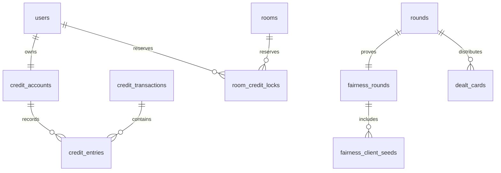

# 전역 가상 크레딧과 공정 게임 설계

| Field | Value |
|---|---|
| Type | technical-design |
| Audience | engineering / reviewers / operators |
| Status | in-progress |
| Source of truth | credit 스키마는 `drizzle/schema.ts`, account-credit 방 수명주기는 `src/features/game/`·`src/features/budget/`·`supabase/migrations/0011`~`0012`, 공개 공정 영수증은 `src/features/fairness/`; 실제 카드 배분은 이 문서의 후속 설계 |
| Last reviewed | 2026-07-24 |

## 목적과 경계

끗발은 **현금·충전·환전·출금이 전혀 없는 가상 크레딧 게임**으로 확장한다. 크레딧은 계정에
귀속되며, 방은 일시적으로 크레딧을 잠그고 게임 결과로만 참가자 사이에서 이동시킨다. 모든
변동과 카드 배분은 나중에 검증할 수 있어야 한다.

이 설계는 `_clevon-softworks/07-cocolounge-db`의 다음 원칙을 참고해 현재 구조에 맞게 새로
작성했다. 원문 스키마나 SQL을 복사하지 않는다.

- 빠른 현재 잔액과 변경 불가 이력을 분리한다.
- 이력은 자동 보정하지 않고, 불일치는 탐지·조사한다.
- 경쟁 상태가 생기는 잔액 변경은 한 트랜잭션 안에서 잠근다.
- DDL, 권한, 원자 처리, 유지보수의 책임을 분리한다.

현금성 기능, 결제수단, 환전율, 출금, 외부 PG 연동은 범위 밖이다. UI에서 `돈`, `입금`,
`출금`, `배당` 같은 표현도 쓰지 않고 `가상 크레딧`, `지급`, `회수`, `정산`만 사용한다.

## 현 상태와 전환 원칙

현재 `chip_ledger`와 `buy_ins`는 방별 세션 칩 이력이다. 이를 전역 잔액으로 억지로 합치면
종료되지 않은 방·정정·과거 바이인을 어떤 시점의 개인 잔액으로 해석할지 알 수 없다.

따라서 전환은 아래 원칙을 따른다.

1. 기존 `chip_ledger`/`buy_ins`는 수정하거나 재작성하지 않는다. 과거 세션 기록으로 계속 읽는다.
2. 새 방은 `rule_preset.fundingMode`으로 `session` 또는 `account_credit`을 고른다. 기존 방과
   값이 없거나 손상된 preset은 안전하게 `session`으로 해석한다. 생성 뒤 재원은 바꾸지 않는다.
3. 기존 계정의 전역 잔액은 자동 이관하지 않는다. 새 지갑은 0 크레딧으로 만들고 관리자가
   명시적인 사유와 함께 지급한다.
4. 모든 이관 정책은 별도 데이터 감사와 운영자 승인 뒤에만 forward migration으로 추가한다.

이 선택은 기존 데이터를 손대지 않고 롤백 가능하게 기능을 도입하기 위한 안전 기본값이다.

## 용어와 상태

| 용어 | 의미 |
|---|---|
| 사용 가능 크레딧 | 새 방에 잠글 수 있는 계정 잔액 |
| 잠금 크레딧 | 진행 중인 방에만 배정된 계정 잔액 |
| 세션 칩 | 방 안에서만 움직이는 `chip_ledger` 잔액 |
| 거래 | 여러 계정/버킷의 크레딧 이동을 묶는 원자 단위 |
| 엔트리 | 거래의 한 계정에 남는 변경 불가 원장 행 |
| 공개 공정 영수증 | 진행 중에도 노출 가능한 commitment·시드 해시·덱 commitment 메타데이터. 형식/배분 규칙만 검사한다. |
| full reveal 감사 자료 | 종료 뒤 인증된 경로에서만 제공하는 server seed·전체 덱 순서. 실제 셔플을 재계산한다. |

`available + locked`가 계정의 총 가상 크레딧이다. 게임 중 베팅은 세션 칩에서만 처리한다.
방을 정산할 때 세션의 최종 칩을 전역 계정으로 되돌린다.

## 데이터 모델

### ERD



### `credit_accounts` — 계정별 현재 잔액 (Entity)

| Column | Type | Constraint | 설명 |
|---|---|---|---|
| `id` | uuid | PK | 계정 식별자 |
| `user_id` | uuid? | FK users, partial UNIQUE | `kind=user`일 때 사용자당 하나의 계정 |
| `kind` | enum | `user` \| `issuance` | 사용자 계정 또는 관리자 지급/회수의 시스템 상대 계정 |
| `available_balance` | bigint | user는 `>= 0`, 모두 안전 정수 범위 | 새 방에 사용할 수 있는 크레딧 |
| `locked_balance` | bigint | user는 `>= 0`, 모두 안전 정수 범위 | 진행 중인 방에 잠긴 크레딧 |
| `version` | bigint | `>= 0` | 낙관적 관측·감사용 단조 증가 버전 |
| `created_at` | timestamptz | not null | 생성 시각 |
| `updated_at` | timestamptz | not null | 마지막 원장 반영 시각 |

이 테이블은 읽기 성능을 위한 materialized balance다. 진실은 `credit_entries`이며, 애플리케이션
롤은 이 테이블을 직접 수정할 수 없다. `issuance` 계정은 한 개만 존재하며 음수 잔액을 가질 수
있어 발행·회수의 반대 엔트리를 보존한다. Drizzle이 현재 `bigint`를 JavaScript `number`로 읽으므로
모든 credit 잔액·엔트리·lock은 `Number.MAX_SAFE_INTEGER` 범위로 DB가 제한한다.

### `credit_transactions` — 거래 헤더 (`[TX]`)

| Column | Type | Constraint | 설명 |
|---|---|---|---|
| `id` | uuid | PK | 거래 식별자 |
| `kind` | enum | not null | `admin_grant`, `admin_revoke`, `room_lock`, `room_settlement`, `correction` |
| `idempotency_key` | text | UNIQUE | 재시도 중복을 흡수하는 서버 생성 키 |
| `room_id` | uuid? | FK rooms | 방 관련 거래일 때만 지정 |
| `round_id` | uuid? | FK rounds | 판 결과 정산일 때만 지정 |
| `initiated_by` | uuid? | FK users | 관리자 또는 시스템 실행 주체 |
| `reverses_transaction_id` | uuid? | UNIQUE FK self | 취소는 새 거래로만 표현 |
| `reason` | text | 1..200 | 관리자 조정·정정의 필수 사유 |
| `snapshot` | jsonb | not null | 표시명·방 코드·정산 근거의 당시 스냅샷 |
| `created_at` | timestamptz | not null | 확정 시각 |

`status` 컬럼을 두고 나중에 바꾸지 않는다. 실패한 작업은 헤더·엔트리를 함께 롤백하고,
잘못 확정한 작업은 `reverses_transaction_id`가 있는 반대 거래로 되돌린다.

### `credit_entries` — 복식 원장 (`[LOG]`)

| Column | Type | Constraint | 설명 |
|---|---|---|---|
| `id` | uuid | PK | 엔트리 식별자 |
| `transaction_id` | uuid | FK credit_transactions | 소속 거래 |
| `account_id` | uuid | FK credit_accounts | 변경 대상 계정 |
| `delta_available` | bigint | not both zero | 사용 가능 잔액 변화 |
| `delta_locked` | bigint | not both zero | 잠금 잔액 변화 |
| `available_after` | bigint | user는 `>= 0`, 모두 안전 정수 범위 | 적용 직후 사용 가능 잔액 |
| `locked_after` | bigint | user는 `>= 0`, 모두 안전 정수 범위 | 적용 직후 잠금 잔액 |
| `created_at` | timestamptz | not null | 기록 시각 |

사용자 계정 엔트리는 거래 전체에서
`SUM(delta_available + delta_locked) = 0`을 만족해야 한다. 최초 지급과 회수는 별도 시스템
발행 계정과 상대 엔트리를 만들며, 일반 사용자 잔액은 절대 음수가 될 수 없다. 이 구조는
단순 `amount` 로그보다 크레딧 생성·소멸과 방 간 이동을 감사하기 쉽다.

### `room_credit_locks` — 방별 잠금 근거 (`[TX]`)

| Column | Type | Constraint | 설명 |
|---|---|---|---|
| `id` | uuid | PK | 잠금 식별자 |
| `room_id` | uuid | FK rooms | 대상 방 |
| `user_id` | uuid | FK users | 대상 사용자 |
| `buy_in_id` | uuid | UNIQUE FK buy_ins | 대응 세션 칩 발행 근거 |
| `lock_transaction_id` | uuid | FK credit_transactions | 잠금 거래 |
| `amount` | bigint | `> 0` | 잠근 크레딧/발행 세션 칩 |
| `released_transaction_id` | uuid? | FK credit_transactions, non-unique | 최종 정산 거래 |
| `created_at` | timestamptz | not null | 잠금 시각 |

새 account-credit 방에서는 `buy_ins`를 세션 칩 발행 내역으로 유지하되, 반드시 이 잠금 행과
1:1로 연결한다. `createRoom`, `joinRoom`, `addBuyIn`은 세션 `buy_ins`·`chip_ledger` INSERT와
`lock_room_credit_buy_in(...)`을 같은 DB 트랜잭션에서 실행한다. `undoLastBuyIn`은 반대 부호
세션 행과 `release_room_credit_buy_in(...)`을 같은 트랜잭션에서 실행하고, release 거래는 원 lock
거래를 `reverses_transaction_id`로 가리킨다. `closeRoom`은 `settle_room_credits(...)`로 남은 모든
active lock을 최종 세션 스택에 맞춰 풀고 방을 settled로 바꾼다.

### `fairness_rounds` — 커밋-리빌 영수증 (`[TX]`)

| Column | Type | Constraint | 설명 |
|---|---|---|---|
| `round_id` | uuid | PK/FK rounds | 판당 한 영수증 |
| `algorithm_version` | text | not null | 고정 알고리즘 식별자 |
| `server_seed_commitment` | char(64) | not null | 시작 전에 공개한 SHA-256 해시 |
| `server_seed_ciphertext` | text | not null | 종료 전에는 서버만 복호화 가능한 시드 |
| `seed_deadline_at` | timestamptz | not null | 참가자 시드 제출 마감 |
| `deck_commitment` | char(64)? | null until deal | 확정 셔플 순서 해시 |
| `final_seed_hash` | char(64)? | null until deal | 결합 시드 해시 |
| `server_seed_revealed_at` | timestamptz? | null until end/void | 공개 시각 |
| `void_reason` | text? | required when voided | 공정 배분 중단의 근거 |
| `created_at` | timestamptz | not null | 커밋 생성 시각 |

서버 시드는 `AUTH_SECRET`에서 파생한 별도 AES-256-GCM 키로 암호화한다. 이 암호화는 DB dump의
평문 노출을 줄이는 방어층일 뿐, 운영 서버 자체가 완전히 탈취된 경우의 공정성을 보장하지는 않는다.

### `fairness_client_seeds` — 참가자 기여 (`[LOG]`)

`(round_id, user_id)`를 PK로 하고 `seed_hash char(64)`, `submitted_at`만 저장한다. 원본
client seed는 DB에 보관하지 않는다. 사용자는 자신의 원본 시드를 브라우저에 보관하거나 종료 후
영수증의 해시와 대조할 수 있다.

### `dealt_cards` — 비공개 카드 배분 (`[TX]`)

`round_id`, `recipient_user_id?`, `position`, `visibility`, `card_ciphertext`, `revealed_card_id?`를
둔다. 진행 중에는 비공개 카드 ID를 응답·Broadcast·공개 스냅샷에 절대 포함하지 않는다. 종료/무효
뒤에만 카드 ID를 공개해 전체 덱 순서를 검증한다.

## 원자 처리와 잠금

전역 잔액을 바꾸는 앱 경로는 목적별 `SECURITY DEFINER` RPC만 호출한다. 관리자 조정은
`admin_adjust_credit(...)`, 방 재원은 `lock_room_credit_buy_in(...)`,
`release_room_credit_buy_in(...)`, `settle_room_credits(...)`가 담당하며 모두 내부
`post_credit_transaction(...)` primitive를 호출한다. 앱 롤은 primitive를 직접 실행할 수 없다.
세션 원장 INSERT와 RPC 호출은 같은 `db.transaction`에 있어 잔액 부족·권한·보존식 검증이 실패하면
세션 행도 함께 rollback 된다.

1. `idempotency_key`를 먼저 조회한다. 이미 확정된 거래면 기존 거래 ID를 반환한다.
2. 대상 `credit_accounts`를 `account_id` 오름차순으로 `FOR UPDATE` 잠근다.
3. 모든 변경 후 잔액을 계산해 사용자 계정의 음수 여부와 거래 합계 0을 검증한다.
4. 거래 헤더와 모든 엔트리를 INSERT하고, materialized balance/version을 같은 트랜잭션에서 갱신한다.
5. 함수는 transaction id와 잔액 요약만 반환한다.

교착을 피하기 위해 방 정산은 `lockRoom`을 먼저 얻은 뒤, 모든 계정 잠금을 정렬 순서로 얻는다.
`room_lock`은 전역 잔액의 `available → locked` 이동과 `buy_ins`/`chip_ledger`의 세션 칩 발행을
하나의 DB 트랜잭션에서 처리한다. 방 종료는 모든 참가자의 `locked → available` 이동을 세션 최종
칩에 맞춰 한 거래로 처리한다.

## 권한과 불변성

- 브라우저는 Supabase 테이블 API로 이 테이블을 읽거나 쓸 수 없다. 현재 앱 경계와 같다.
- `kkeutbal_app`에는 credit 테이블의 직접 INSERT·UPDATE·DELETE 권한을 주지 않는다. 조회와
  `ensure_credit_account`, `admin_adjust_credit`, `lock_room_credit_buy_in`,
  `release_room_credit_buy_in`, `settle_room_credits`만 허용하고 `post_credit_transaction` 실행 권한은
  주지 않는다.
- `credit_entries`와 `credit_transactions`에는 `BEFORE UPDATE OR DELETE` 거부 트리거를 둔다.
- `credit_accounts` 직접 UPDATE에는 거부 트리거를 두고, posting 함수가 설정하는 트랜잭션 로컬
  플래그가 있을 때만 통과시킨다.
- `room_credit_locks`는 전용 RPC만 null→값 release 전이를 수행한다. lock RPC는 room/user/buy-in/
  amount와 역할을 확인하고, release RPC는 원 buy-in과 reversal buy-in·원 lock 거래를 모두 대조한다.
  settlement RPC는 모든 active lock 합계와 room `chip_ledger` 합계를 대조한다. 한 정산 거래가
  여러 lock을 함께 release하므로 이 열은 unique가 아니다.
- 관리자 지급·회수·정정은 관리자 Server Action만 호출할 수 있고 `reason`·`initiated_by`를
  필수로 남긴다. UI는 실제 원장을 수정하는 버튼을 제공하지 않고 새 거래를 만든다.
- `fairness_rounds`의 commitment, deadline, algorithm version은 첫 카드 배분 뒤 변경할 수 없다.
  판 무효도 행 삭제가 아니라 사유와 공개 시드 기록으로 남긴다.

## 공정 셔플 프로토콜

알고리즘 ID는 `kkeutbal-commit-reveal-hmac-fy-v1`이다. 구현은
`src/features/fairness/protocol.ts`가 소유하며, 아래 문자열 배열을 `JSON.stringify`한 UTF-8 bytes로
해시한다. 모든 seed/hash는 32바이트 소문자 hex다.

1. 서버는 무작위 32바이트 `serverSeed`를 만들고
   `SHA-256(["kkeutbal/fairness/v1", "server-commit", roundId, serverSeed])`를 commitment로 공개한다.
2. 마감 전 각 참가자는 32바이트 `clientSeed`를 생성한다. 서버는 원문을 버리고
   `SHA-256(["kkeutbal/fairness/v1", "client-seed", roundId, userId, clientSeed])`만 저장한다.
3. 마감 후 `(userId, seedHash)`를 `userId` 오름차순으로 정렬하고,
   `SHA-256(["kkeutbal/fairness/v1", "final-seed", roundId, serverSeed, pairs])`로 final seed를 만든다.
4. final seed를 HMAC-SHA-256 key로 쓰고, counter `0, 1, …`마다
   `HMAC(finalSeed, JSON(["kkeutbal/fairness/v1", "draw", roundId, counter]))` 32 bytes를 난수 스트림으로
   사용한다.
5. Fisher–Yates를 뒤에서 앞으로 실행한다. 범위 `n`의 index는 32-bit word가
   `floor(2^32 / n) * n` 미만일 때만 `word % n`으로 사용한다. 거절 표본은 버린다.
   이 rejection sampling은 modulo bias를 제거한다.
6. 배분 뒤 `deck_commitment = SHA-256(["kkeutbal/fairness/v1", "deck", shuffledCardIds])`를 저장한다.
   종료 또는 무효 때 server seed, 정렬된 client seed hash, 전체 카드 순서와 함께 공개한다.

참가자가 시드를 내지 않아도 round participant 목록과 마감 시각은 영수증에 남는다. 누락은
서버가 임의 시드를 보태지 않고 빈 목록으로만 처리한다. 한 명의 성실한 client seed만 있어도
서버가 시작 전 결과를 고정해 조작할 수 없게 만든다.

## 방 설정과 타임아웃

현재 라이브 preset에는 아래 재원 필드만 저장한다. `src/features/game/funding-mode.ts`가 과거·손상
preset을 `session`으로 해석하므로 기존 방이 우연히 전역 잔액을 쓰지 않는다.

```ts
{ fundingMode: 'session' | 'account_credit' }
```

공정 배분 설정은 아직 DB/화면에 노출하지 않는다. `src/features/game/fair-play-settings.ts`의 순수
검증기는 다음 후속 preset 구조를 고정하지만, verified deal 상태기계가 없는 동안 `verified`를
선택할 수 있게 만들지 않는다.

```ts
{
  dealing: 'manual' | 'verified',
  seedCollectionSeconds: 10..120,
  turnTimeoutSeconds: 15..180,
  timeoutPolicy: 'pause',
}
```

- `verified`는 섯다·포커만 지원 후보이며, 한 번 판이 시작되면 dealing·seed timeout은 바꾸지 못한다.
- 기본 timeout 정책은 `pause`다. 네트워크 끊김을 패배·자동 베팅으로 바꾸지 않는다.
- 추후 게임별로 안전성이 증명된 경우에만 `auto_check_or_fold`를 추가한다. 섯다·포커·고스톱은
  타임아웃에서 가능한 행동이 서로 다르므로 공통 자동 행동을 지금 넣지 않는다.
- 호스트/딜러만 일시 정지 후 재개할 수 있고, pause/resume은 감사 이벤트로 남긴다.

실제 카드 배분 지원 순서는 섯다(2장 비공개) → 포커(2장 비공개+보드) → 고스톱(게임 규칙·턴
상태를 서버 authoritative로 확장한 뒤)이다. 현재 수동 결과 기록 흐름에 비밀 카드를 섞어
부분 구현하지 않는다.

## API·화면 경계

| 표면 | 권한 | 제공 내용 |
|---|---|---|
| `/wallet` | 로그인 사용자 | 사용 가능/잠금 크레딧과 최근 자신의 거래 내역 |
| `/wallet/transactions/[id]` (계획) | 거래 당사자 또는 관리자 | 거래 엔트리·스냅샷·정정 연결 |
| `/admin` | 관리자 | 현재 지급/회수 생성과 감사 사유; 검색·정정 UI는 계획 |
| `/rooms/{code}/fairness` (계획) | 방 참가자 | commitment, client seed hash, 마감, 종료 후 검증 영수증 |
| `refreshRoom` | 공개 점수판만 | 비공개 카드·server seed·원본 client seed를 포함하지 않음 |
| `getMyPrivateHand` (계획) | 해당 round participant | 진행 중 본인 카드만, 서버 액션 응답으로 반환 |

Broadcast 이벤트는 `fairness.committed`, `fairness.seed_submitted`, `fairness.revealed`,
`round.paused` 같은 refetch 힌트만 담는다. seed, hand, deck 순서는 절대 payload에 넣지 않는다.
공개 영수증의 deal-plan 검사는 구조 검증일 뿐이다. 실제 암호학적 검증은 종료 뒤 full reveal과
원래 덱을 함께 `verifyPublicFairnessAudit`으로 재계산할 때만 성공으로 표시한다.

## 정합성 감시와 운영

자동 수정 job은 만들지 않는다. 다음 읽기 전용 검사만 운영한다.

1. 각 `credit_accounts`의 현재 잔액과 마지막 `credit_entries.*_after`가 같은지 확인한다.
2. 각 `credit_transactions`의 엔트리 합이 0인지 확인한다.
3. `room_credit_locks.amount`와 대응 `buy_ins.amount`가 같은지, settled room에 미해제 lock이 없는지 확인한다.
4. 공개된 fairness receipt의 commitment, final seed, deck commitment를 독립 verifier로 재계산한다.
5. seed deadline 뒤 서버 seed 공개 전 장시간 멈춘 판과 void 비율을 관리자에게 알린다.

불일치가 나면 알림·조사 티켓만 만들며 원장을 자동 변경하지 않는다. 원장 보존 기간은 계정이
삭제돼도 유지하고, 개인정보 표시명은 snapshot과 별도로 마스킹한다.

## 위협 모델과 한계

이 설계는 서버가 이미 커밋한 시드를 몰래 교체하거나 사후 셔플을 바꾸는 행위를 검출한다.
하지만 다음은 해결하지 않는다.

- 애플리케이션·DB·`AUTH_SECRET`이 모두 탈취된 공격자
- 모든 참가자가 공모해 client seed를 조작하는 상황
- 사람이 결과를 보고 판을 무효 처리하는 운영 행위

마지막 항목은 기술적으로 숨기지 않는다. void 사유, 시드 공개, 딜 전/후 상태를 남겨 빈도와
근거를 참가자가 확인하게 한다. 공정성은 "절대 신뢰"가 아니라 **조작을 어렵게 하고, 발생하면
증거를 남기는 것**으로 정의한다.

## 구현 순서와 완료 조건

1. [x] 공정 셔플 순수 모듈과 벡터 테스트, 공개 안전 영수증 경계를 추가한다.
2. [x] 계정 지갑 테이블/enum/제약의 Drizzle DDL 및 Supabase 권한·함수 migration을 추가한다.
3. [x] 계정 지갑·관리자 지급/회수·거래 내역을 구현하고, 원격 DB rollback 트랜잭션으로 RPC를 검증한다.
4. [x] account-credit 방의 lock/buy-in/release/settlement 연결과 원격 rollback lifecycle 검증을 구현한다.
5. 섯다 verified deal, private hand action, fairness receipt 화면을 구현한다.
6. 2인 인증 E2E에서 시드 제출·타임아웃·정산·공개 검증을 확인한다.

각 단계는 현재 수동 기록 방을 깨지 않아야 한다. 2~4단계는 기존 잔액을 이관하지 않는 기본 정책을
전제로 하며, 이관이 필요해지면 별도 승인된 설계 변경으로 다룬다.

## Change History

- 2026-07-24: account-credit 방 생성 선택, buy-in lock·취소 release·종료 settlement을 live DB RPC와
  Server Action 트랜잭션으로 연결했다. full reveal 없는 공정 영수증은 여전히 검증 완료로 표시하지 않는다.
